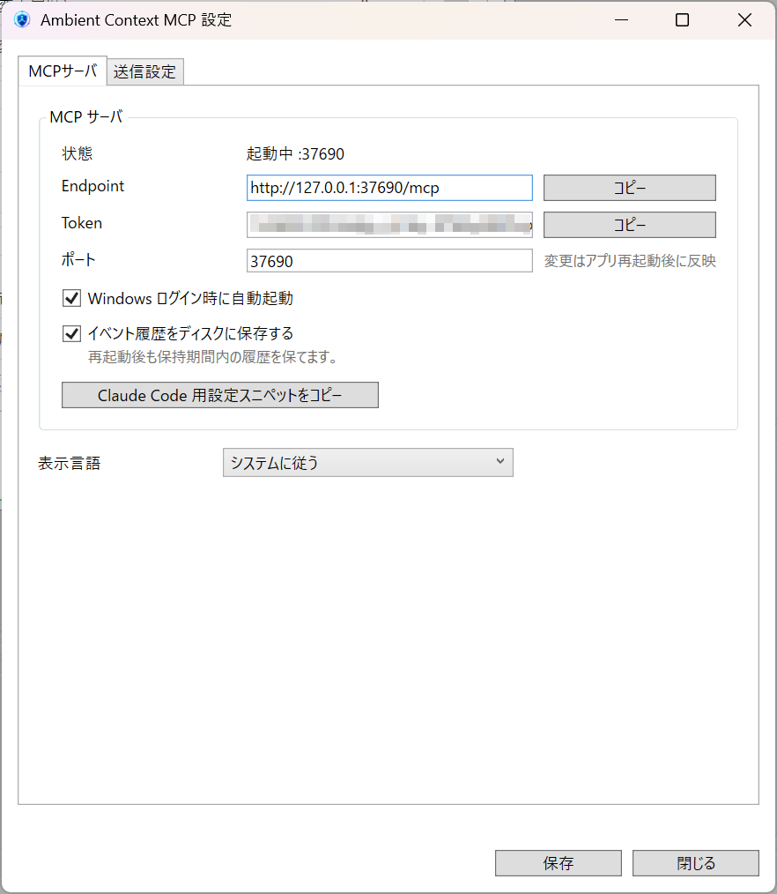
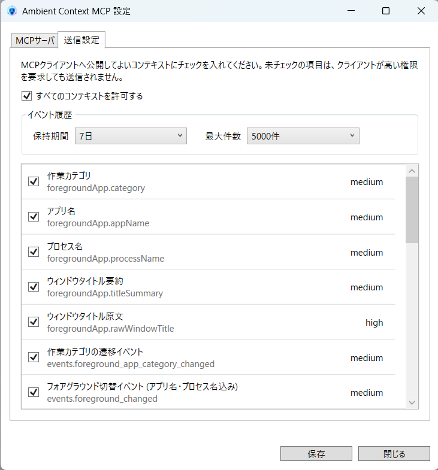

# Ambient Context MCP

[](https://modelcontextprotocol.io)
[](#requirements)
[](https://dotnet.microsoft.com)
[](https://github.com/nassie256/ambient-context-mcp/releases)
[](LICENSE)

**en** | [ja](README.md)

A tray-resident process that exposes local Windows ambient context (presence, foreground app category, battery, power events, system load, long-session detection, etc.) to AI clients (Claude Code, Claude Desktop, etc.) as privacy-classified MCP tools.

<p align="center">
  
  
</p>

## Features

- **Local-only**: Listens on 127.0.0.1 only — no outbound network traffic
- **Off by default**: Medium / high sensitivity fields are not transmitted unless explicitly opted in
- **Small footprint**: A single tray-resident process
- **MCP Streamable HTTP**: Served at `http://127.0.0.1:37690/mcp`, Bearer token required
- **Privacy diagnostics**: `ambient_context_get_policy` lets clients self-diagnose "why this value is not being sent"
- **Bilingual UI**: Japanese / English, follows OS culture by default; switchable from the settings dialog

## Three exposed tools

| Tool | Description |
|---|---|
| `ambient_context_get_states` | Current context states (presence, battery, foreground app category, etc.) |
| `ambient_context_poll_events` | Unread events past the per-client cursor (user_returned, ac_power_connected, etc.) |
| `ambient_context_get_policy` | Sensitivity classifications and effective transmit decisions (no live data) |

## Quick start

### A. Claude Desktop (MCPB bundle)

Download `ambient-context-mcp-vX.Y.Z.mcpb` from the [Releases](https://github.com/nassie256/ambient-context-mcp/releases) page and drag-and-drop it onto the Claude Desktop window. After confirming **Install**, Claude Desktop will auto-spawn the tray and the tools become available.

> The tray stays a single-process to preserve the single LocalContextHub. The MCPB bridge only spawns the tray if it isn't already running; otherwise it attaches to the existing one.

### B. Claude Code / other clients (Streamable HTTP)

Extract the archive (`ambient-context-mcp-vX.Y.Z-win-x64.zip`) and run `ambient-mcp.exe`.

1. Launch the app → the tray shows `[●] Ambient Context MCP — :37690`
2. Click the tray icon → the settings dialog opens
3. On the **Transmission** tab, check the contexts you want to expose → Save
4. Tray menu → **Copy Claude Code config**
5. Paste into any terminal

```cmd
claude mcp add ambient-context \
  --transport http http://127.0.0.1:37690/mcp \
  --header "Authorization: Bearer <TOKEN>"
```

6. From Claude Code you can now call `ambient_context_get_states` and so on.

> **UI language**: defaults to your OS culture. To switch, open **MCP Server → Display language**, choose Japanese / English, save, and restart the app. The privacy classification rationales returned by `ambient_context_get_policy` follow the same setting.

## Documentation

- [docs/tool-spec.md](docs/tool-spec.md) — MCP tool contract (input/output, scope, auth)
- [docs/privacy-classifications.md](docs/privacy-classifications.md) — Default transmission policy
- [docs/client-config.md](docs/client-config.md) — Claude Code / Desktop config examples
- [docs/windows-implementation.md](docs/windows-implementation.md) — Windows-specific implementation notes

## Requirements

- Windows 10 1903 (10.0.18362) or later
- .NET 8 Desktop Runtime x64 (only for framework-dependent builds)

## Build

```powershell
# Dev build
dotnet build src\windows\AmbientContextMcp.sln

# Release artifacts (produces both the zip and the .mcpb)
pwsh tools\build-release.ps1                  # version is read from mcpb/manifest.json
pwsh tools\build-release.ps1 -Version 0.4.0   # explicit
pwsh tools\build-release.ps1 -SkipZip         # mcpb only
pwsh tools\build-release.ps1 -SkipMcpb        # zip only
```

To enable `mcpb validate`, install the CLI first with `npm i -g @anthropic-ai/mcpb`. Without it, the script falls back to `Compress-Archive` to build the `.mcpb` (manifest validation is skipped).

## File layout

```
%LOCALAPPDATA%\AmbientContextMcp\
├── settings.json          # User settings (transmission opt-in, port, token)
├── ambient-context.json   # Local cache of the latest snapshot (for debugging)
├── events.jsonl           # Event history (only when persistence is enabled)
└── mcp-api.json           # Discovery info for the running MCP (removed on exit)
```

## License

[MIT](LICENSE)
